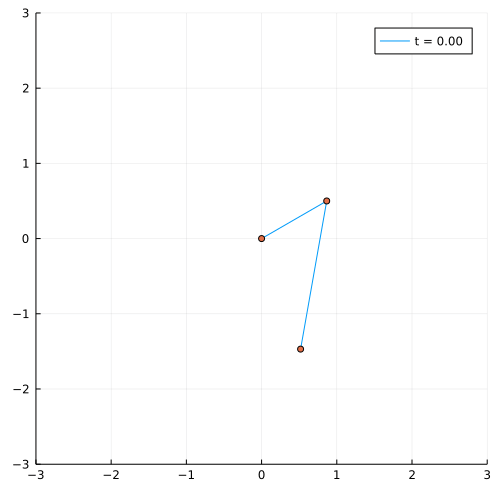

# Double Pendulum

Simple demonstration of an undamped double pendulum made in Julia.



## Usage
Navigate to the working directory, activate, then (if needed) instantiate the project environment:
```
julia> ]

pkg> activate .

pkg> instantiate
```
To run the script non-interactively:
```
$ julia --project=. pendulum.jl
```
Interactively:
```
julia> include("pendulum.jl")
```

## Interesting Links
- [https://www.diego.assencio.com/?index=1500c66ae7ab27bb0106467c68feebc6](https://www.diego.assencio.com/?index=1500c66ae7ab27bb0106467c68feebc6)
- [https://math24.net/double-pendulum.html](https://math24.net/double-pendulum.html)
- [https://www.brown.edu/Departments/Engineering/Courses/En4/Notes/vibrations_mdof/vibrations_mdof.htm](https://www.brown.edu/Departments/Engineering/Courses/En4/Notes/vibrations_mdof/vibrations_mdof.htm)